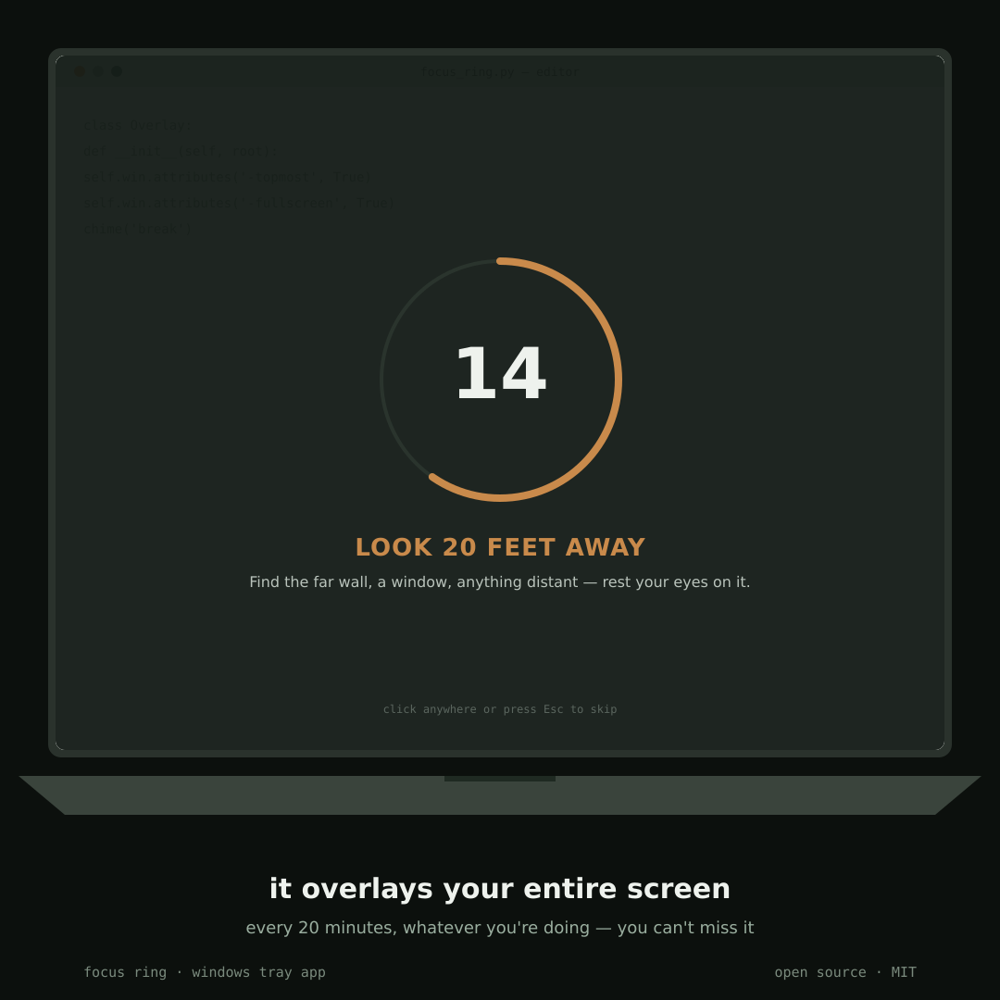

# Focus Ring

A 20-20-20 eye-break tool that actually gets in your way. Every 20 minutes, it drops a fullscreen overlay over whatever you're doing — editor, browser, anything — with a ring that drains down while you look at something 20 feet away for 20 seconds.

> Every 20 minutes, look at something 20 feet away for 20 seconds.



## Windows overlay (the main tool)

`windows/focus_ring.py` — lives in your system tray. When the 20 minutes are up, a translucent fullscreen overlay appears **over every other window**, dark scrim with an amber ring draining toward the break's end. Not something you can alt-tab past.

```bash
cd windows
pip install -r requirements.txt
pythonw focus_ring.py       # runs silently, tray icon only
```

Right-click the tray icon for:
- Take a break now
- Pause / resume
- Breaks-today and streak

Add a shortcut in `shell:startup` (targeting `pythonw.exe path\to\focus_ring.py`) to have it start on login. Click anywhere on the overlay, or press Esc, to skip a break early. Stats persist at `~/.focus_ring/stats.json`.

## Web version (lightweight fallback)

`web/focus-ring.html` — for when you're not on Windows, or just want something quick with zero install. A single self-contained file: open it in a browser and pin the tab.

- Countdown ring styled as a lens distance scale (1ft → 20ft)
- Tab title tracks the timer live, so you don't need to switch to it
- Desktop notification + chime at each transition
- Breaks-today and streak persist locally

It's a browser tab, so it's easy to ignore, the Windows overlay is the one built to actually be followed.

## Why this design

Eye-strain tools tend to look like generic productivity timers. Both versions are built around the actual physical object the rule references, a lens barrel's distance scale, so the ring isn't just counting down, it's sweeping toward 20 feet.

## License

MIT — see [LICENSE](LICENSE).
